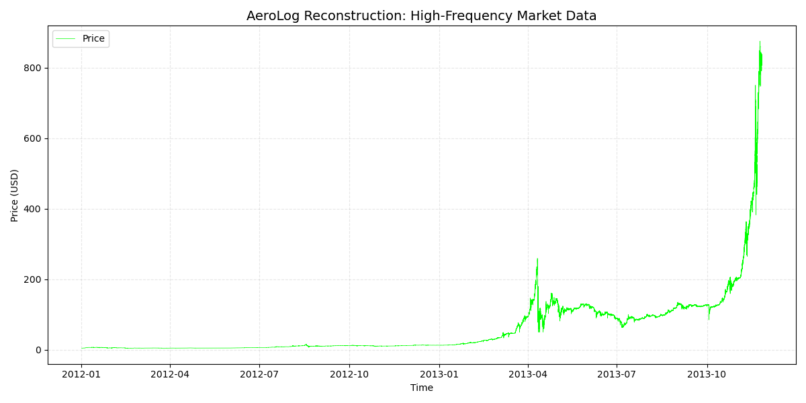

# AeroLog: Zero-Latency HFT Telemetry System

A high-throughput, lock-free IPC logging library for latency-sensitive trading applications.

## Overview

AeroLog is a C++ telemetry engine designed for High-Frequency Trading (HFT) environments where every microsecond counts. Unlike standard logging libraries that block the main execution thread to write to disk, AeroLog uses a Single-Producer Single-Consumer (SPSC) lock-free ring buffer in Shared Memory.

This architecture decouples the "Hot Path" (Trading Strategy) from the "Cold Path" (Disk I/O), allowing the main application to log data in nanoseconds while a separate "Sidecar" process handles disk persistence asynchronously.

## Key Features

*   **Zero-Latency Hot Path**: Writes to shared memory in <100ns (P99), eliminating system call overhead.
*   **Lock-Free Architecture**: Uses `std::atomic` and memory barriers (acquire/release) instead of Mutexes to prevent thread contention.
*   **Zero-Copy IPC**: Producer and Consumer access the same physical RAM pages via `mmap`, avoiding expensive kernel-space memory copying.
*   **Crash Resilience**: Data persists in Shared Memory (`/dev/shm`) even if the main application crashes.
*   **Market Replay Mode**: Includes a simulation engine to replay historical market data (CSV) at full throttle.

## Performance Benchmarks

We compared AeroLog against standard C++ file I/O (`std::ofstream`) by logging 1,000,000 financial events.

| Method | Total Time (1M Logs) | Throughput | Status |
| :--- | :--- | :--- | :--- |
| Standard I/O | 501 ms | ~1.9M logs/s | BLOCKED by Disk Speed |
| AeroLog | 29 ms | ~34.4M logs/s | Non-Blocking (CPU Bound) |

**Result**: AeroLog is approximately 17x Faster than standard blocking I/O.



## Architecture

The system consists of three distinct components:

1.  **The Producer (Trading Engine)**:
    *   Maps a Ring Buffer into process memory.
    *   Writes binary trade data to the Head pointer.
    *   Cost: ~20 CPU cycles (Atomic Store).

2.  **The Ring Buffer (Shared Memory)**:
    *   Size: 1,048,576 slots (approx 33MB).
    *   Circular design ensures constant memory usage with no allocation/deallocation spikes.

3.  **The Consumer (Sidecar)**:
    *   Runs as a separate background process.
    *   Polls the Tail pointer and drains data to disk in optimized batches.
    *   Converts raw RAM bytes to a binary log file (`.alog`).

## Installation & Usage

### Prerequisites

*   Linux (Ubuntu/WSL2 recommended)
*   g++ (Support for C++11 or higher)
*   Python 3 (for analysis)

### 1. Compile the System

```bash
cd src
g++ producer.cpp -o producer -lrt
g++ consumer.cpp -o consumer -lrt
```

### 2. Run the Sidecar (Consumer)

Start the logger first. It will listen for incoming data.

```bash
./consumer
# Output: Sidecar: Listening for market data...
```

### 3. Run the Trading Engine (Producer)

In a separate terminal, run the producer. It will replay the `trades.csv` dataset.

```bash
./producer
# Output: Producer finished. Replayed 10000+ trades.
```

### 4. Analyze the Data

Decode the binary log file using the Python analyzer.

```bash
cd ../analyzer
python3 dashboard.py
```

## Project Structure

```text
AeroLog/
├── src/
│   ├── producer.cpp       # The HFT Engine (Hot Path)
│   ├── consumer.cpp       # The Logging Sidecar (Cold Path)
│   └── shm_shared.hpp     # Shared Memory Ring Buffer Logic
├── analyzer/
│   ├── reader.py          # Binary (.alog) decoder
│   └── dashboard.py       # Data visualization tool
├── benchmark/
│   └── latency_test.cpp   # Performance testing suite
└── trades.csv             # Historical market data (Sample)
```
